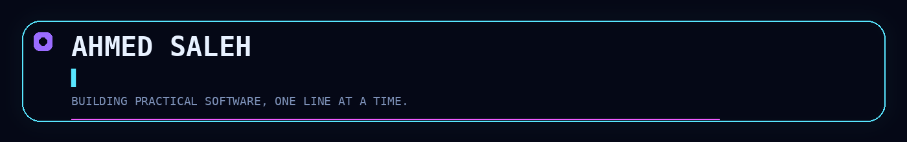
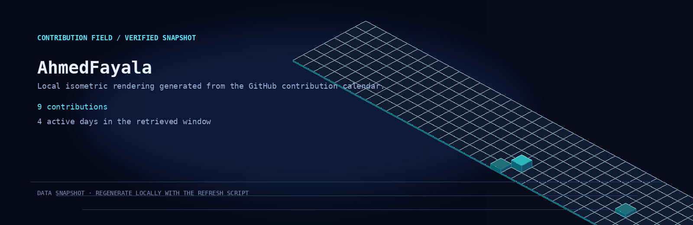

  

  <strong>Python Developer · Telegram Systems · AI Automation</strong> 
  <em>Building practical software, one line at a time.</em>

  
  
  <a href="https://github.com/AhmedFayala">GitHub</a>

  

## The signal

I am **Ahmed Saleh**, a Python developer based in Egypt. My current public profile is centered on **Telegram systems**, **AI automation**, and practical software with readable documentation and maintainable structure.

> Build the useful thing. Keep the system understandable.

  

## What I am building

| Focus | Verified direction |
|---|---|
| **Python systems** | Python is the primary language of the current private project, with `uv` and a committed lockfile supporting reproducible setup. |
| **Telegram experiences** | CardX Pro is documented as a professional Telegram bot built with `aiogram 3.x`, including bilingual support and user flows. |
| **AI automation** | The public profile repository is tagged with `ai` and `automation`, and the account bio identifies AI enthusiasm as a current interest. |
| **Readable engineering** | The current project includes architecture, development guidance, technical principles, change history, project memory, and tests. |

## Selected build signal

### CardX Pro · private project

A private Python project documented as a professional Telegram bot built with **aiogram 3.x**. Its repository README records bilingual Arabic/English support, user registration and profile management, media-rich welcome messages, HTML-formatted output, and an SQLite database using WAL mode.

The project remains private. This profile intentionally describes only the verified public-facing project facts and does not expose private source code or repository internals.

## Technical focus

  

## Contribution field

  

This is a locally generated visual snapshot rather than a third-party dynamic card. The displayed totals were captured on **2026-08-12 UTC**. Refresh instructions are documented in [`docs/refreshing-profile-assets.md`](docs/refreshing-profile-assets.md).

## How I build

| 01 | 02 | 03 | 04 |
|---|---|---|---|
| Clarify the problem | Design the flow | Build incrementally | Test and document |

I value focused scope, clear interfaces, sensible defaults, and software that remains understandable after the first release.

  

## Connect

For a Python automation idea, a Telegram product, or an AI-enabled workflow, reach me on [Telegram](https://t.me/Mr_Ahmed_Saleh).

| Metadata | Status |
|---|---|
| **Website / portfolio** | Not provided yet. |
| **Public email** | Not provided yet. |
| **Preferred contact** | Telegram is the currently verified public contact channel. |

  Designed for clarity. Built for useful work.

